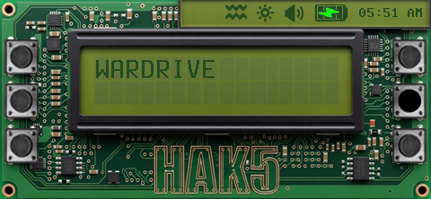
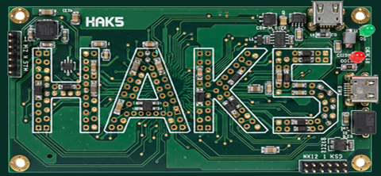

# Circuitry

### Author: brAinphreAk

  
  

A circuit board themed skin for the Hak5 WiFi Pineapple Pager. Every screen is designed to look like a real PCB, with green solder mask traces, component silkscreens, and LCD-style readouts.

## Features

- Full PCB circuit board aesthetic across all screens
- Custom push-button style dashboard navigation (left/right columns)
- LCD-inspired color palette with dark green text on teal backgrounds
- Multi-color baked battery icon with transparent text overlay
- Custom boot animation
- Themed keyboards with PCB-style key highlights
- Custom backgrounds for all dialogs, wizards, settings, and recon screens
- Light green folder icons and payload UI elements

## Dashboard Layout

| Left Column | Right Column |
|-------------|-------------|
| Alerts | PineAP |
| Payloads | Wardrive |
| Recon | Settings |

## Installation

1. Copy the `Circuitry` folder to `/root/themes/` on your WiFi Pineapple Pager
2. Select the theme from Settings > Display > Theme

## Firmware Version

Developed and tested on WiFi Pineapple Pager firmware version 1.0.7

## Credits

All artwork and design by brAinphreAk
