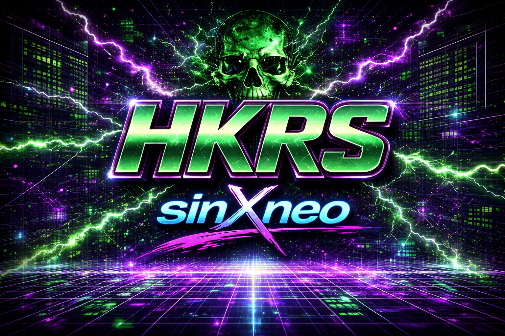

# HKRS

**Author:** sinXneo
**Framework Version:** 0.5

A high-contrast cyberpunk theme with a neon green and purple palette, skull motifs, and a terminal-hacker aesthetic.



## Features

- **Full-width dashboard** with 5 skull icons spread across the screen in a staggered layout
- **Custom boot animation** — 12 frames of terminal boot text building line-by-line while a skull materializes on the right side
- **Skull-themed lock screen** — large centered skull, hex grid background, and "// SYSTEM LOCKED //" overlay
- **Payload log indicators** — color-coded skull banners for running (green), complete (cyan), error (red), and stopped (gray) states
- **Section-color backgrounds** — each section has its own accent color: Settings (purple), PineAP (green), Payloads (magenta), Alerts (red), Recon (cyan)
- **Fixed toggle switches** — ON state shows bright neon green knob on dark track; OFF state shows gray knob on dark track
- **HKRS branding** — logo and sinXneo watermark in backgrounds, skull watermarks in all section and dialog screens

## Color Palette

| Name | Color |
|------|-------|
| Primary | Neon Green `#39FF14` |
| Secondary | Purple `#9600DC` |
| Accent | Magenta `#FF00AA` |
| Recon | Cyan `#00E6B4` |
| Danger | Red `#FF1E3C` |

## Install

```
scp -r HKRS/ root@<pager-ip>:/root/themes/
```

Then on the pager: **Settings → Display → Theme → HKRS → Apply**
