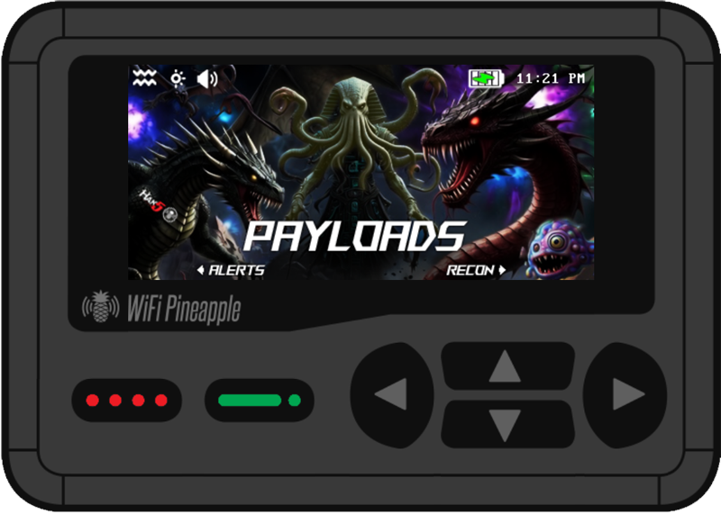
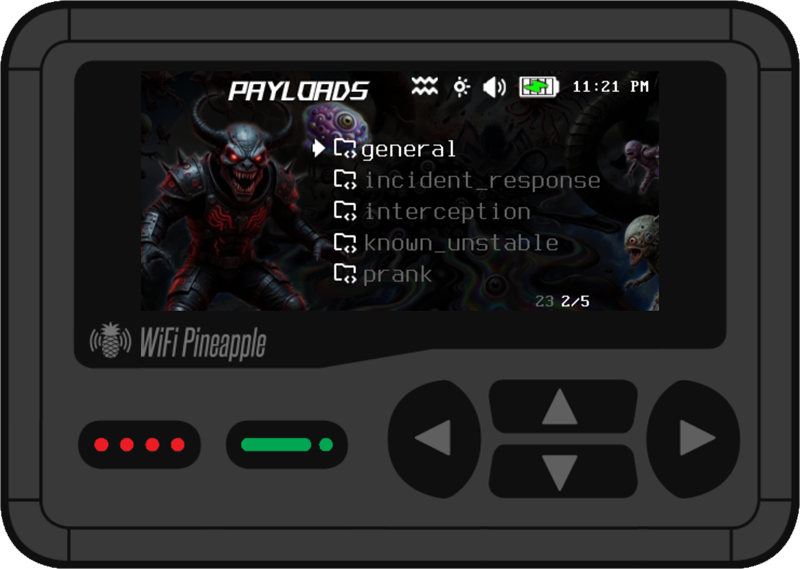
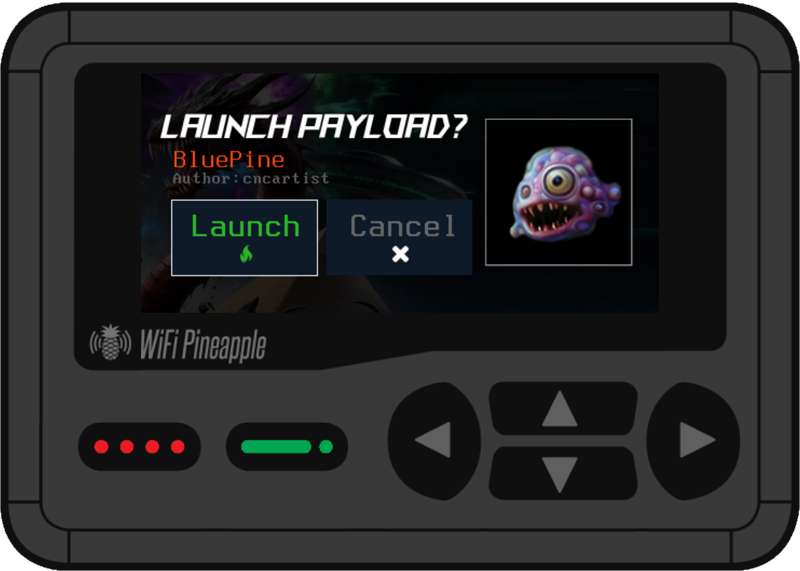
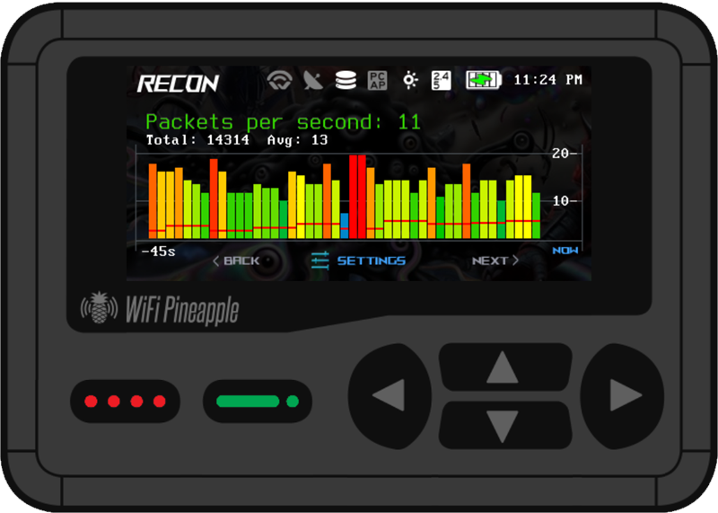
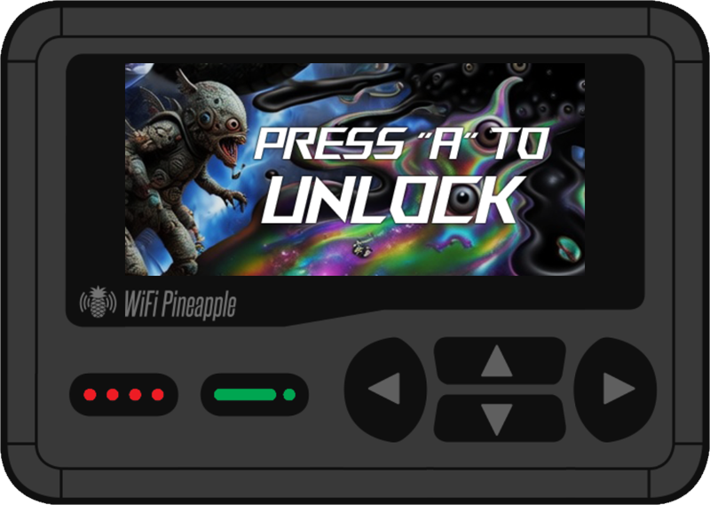
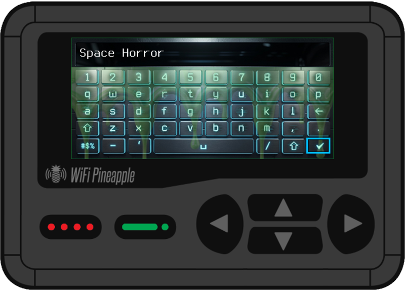
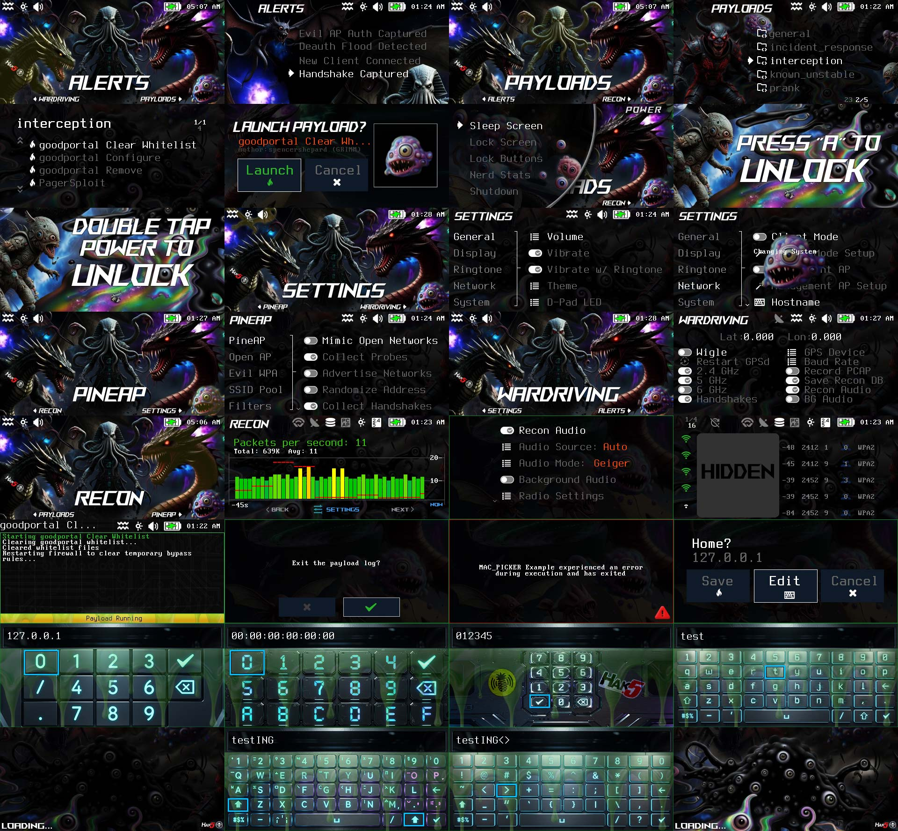

# Space Horror
"Space Horror" is a dark colorful theme optimized for the pager with a space ambience and many unique backgrounds and creatures.  The theme is built from "Zombie UFO" which is made for FW 1.0.7+, tested on 1.0.9.  I hope you have as much fun using my theme as I did creating it.

During testing with other themes, the pager would run very warm and possibly overheat over a long period of time.  "Space Horror" is optimized to not overheat the pager while keeping a nice color contrast and full graphics.  It has been tested for days running payloads at 50% brightness (in moderate temperature environments) without any issue.  

# Space Horror Theme Screenshots

Thanks again Zombie Joe!
