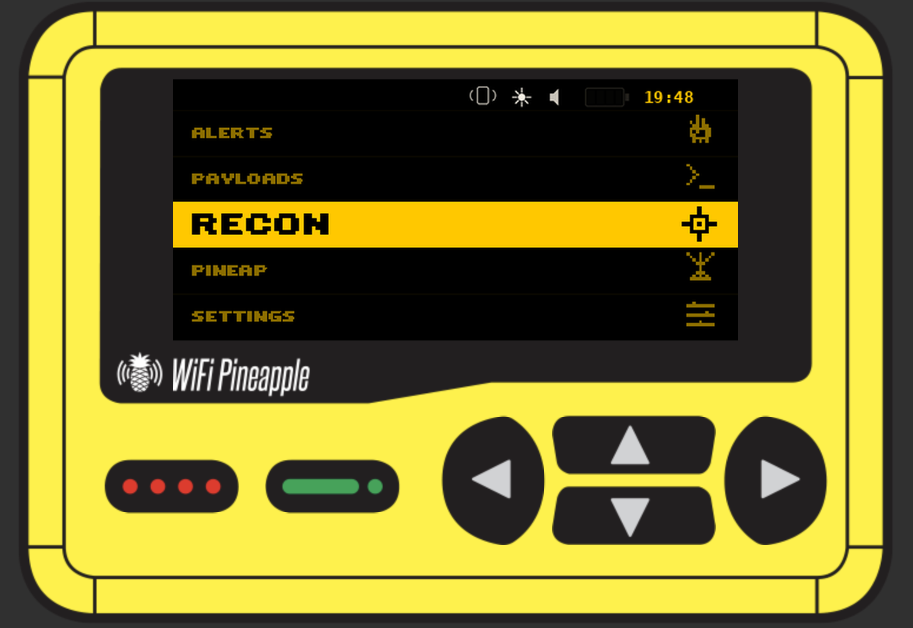
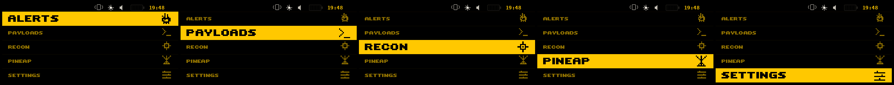
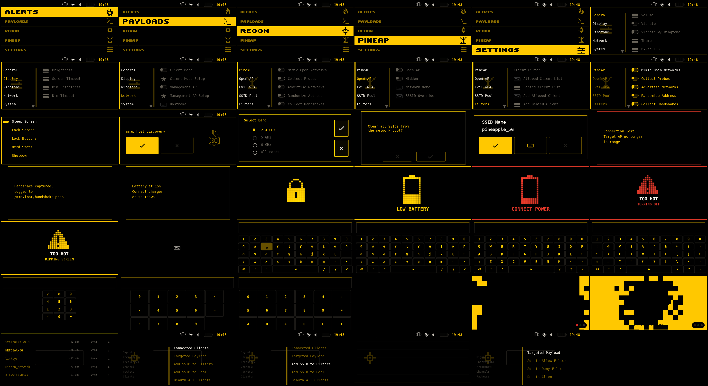
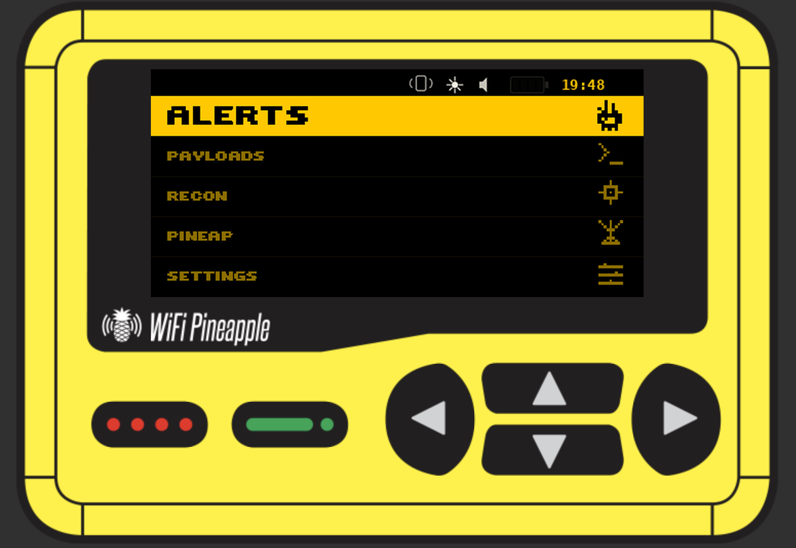
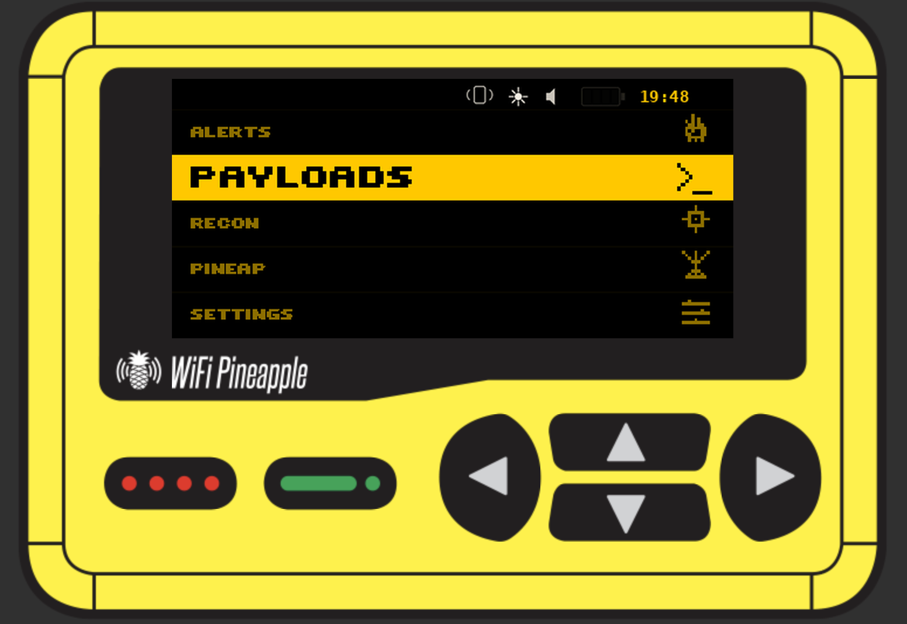

# Frondy

**Black and yellow, black and yellow.**



A high-contrast theme for the WiFi Pineapple Pager built on two colors and nothing else. Named for the frond, the leafy crown of a pineapple.

## Screenshots

<details>
<summary>Dashboard (all five bands)</summary>



</details>

<details>
<summary>Full theme overview</summary>



</details>

<details>
<summary>On-device mockups</summary>

| Alerts | Payloads | Recon |
|--------|----------|-------|
|  |  |  |

</details>

## Author

**superbasicstudio**

- [superbasic.studio](https://superbasic.studio)
- [GitHub](https://github.com/superbasicstudio)

## Description

Two colors. Every screen. No exceptions. Black and yellow, black and yellow.

Frondy runs pure black backgrounds against bold yellow accents across the entire Pager interface. Dashboards, submenus, dialogs, keyboards, wizards, boot animation, warning screens, all of it lives in the same monochrome palette with no per-section color variation.

The dashboard uses five full-width horizontal bands instead of the standard grid. Pick a band and it fills solid yellow with black text and icons. The rest stay dark with dim yellow labels. Custom 8-bit pixel art icons mark each section.

Subpages have ghost watermarks and nav icons so you always know which section you're in.

The boot sequence fades from a WOPR-style initialization screen into the Frondy title card over 16 frames.

All 261 PNG assets are programmatically generated at 3x resolution and downscaled with LANCZOS anti-aliasing. The loading indicator runs a thin progress bar on a full-bleed black background.

## The Palette

| Element | Description |
|---------|-------------|
| **Background** | Pure black (#000000), maximum contrast on the Pager LCD |
| **Primary** | Yellow (255, 200, 0), used for text, icons, and highlights |
| **Dim** | Dark yellow (140, 110, 0), unselected items and ghost watermarks |
| **Dashboard** | Five full-width horizontal bands, unique to this theme |
| **Selection** | Solid yellow fill with black text and icons |
| **Ghost watermarks** | Section icons tilted +25 degrees, bleeding off bottom-right |
| **Nav markers** | 48x48 section icons on the submenu left edge |
| **Spinner** | Thin progress bar (4px tall), full-bleed black |
| **Boot** | 16 frames, WOPR dissolve into clean Frondy title card |
| **Icons** | Custom 8-bit pixel art on 9x9 grids, rendered from SVG |
| **Coverage** | 113 JSON components, 261 PNG assets, every screen themed |

## Compatibility

Developed for WiFi Pineapple Pager firmware **1.0.7** (OpenWrt 24.10.1 base, theme framework 0.5).

## Installation

Transfer the `frondy` directory to your Pager:

```
scp -r frondy/ root@172.16.52.1:/mmc/root/themes/
```

Or drop it in through the Pager web UI theme manager.

Then pick **Frondy** from Settings > Display > Theme.

## Regenerating Assets

The `generate_frondy_assets.py` script regenerates all 261 PNG assets from source parameters using Python + Pillow. Runs on your workstation, not the Pager.

```
pip install Pillow
python3 generate_frondy_assets.py
```

Useful for tweaking the palette, adjusting layouts, or forking into a variant without hand-editing individual assets.

## Known Issues

- Font rendering is hardcoded in the Pager firmware, no typeface customization available yet
- Theme framework version 0.5, the spec may shift between firmware updates

## License

Community theme for the Hak5 WiFi Pineapple Pager.
Subject to the [Hak5 Software License Agreement](https://hak5.org/license).
