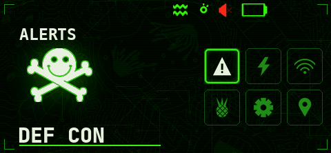
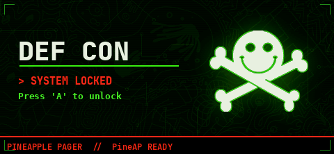
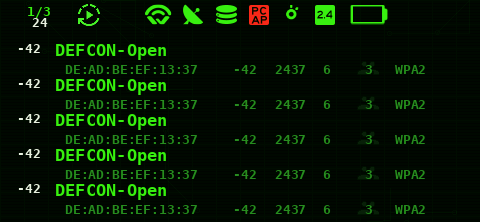
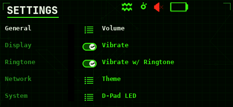
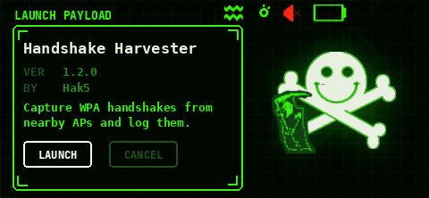

# jack

A DEF CON theme for the WiFi Pineapple Pager based on Jack the DEF CON mascot.

**Author:** Milot Shala
**Theme version:** 1.0
**Theme framework version:** 0.7
**Developed for firmware:** 1.1.0. Firmware 1.0.8 and 1.0.9 use framework 0.6 and will warn about the version.
**Based on:** the `dedsec` theme by **Ser0ka**. Screen layouts and component coordinates descend from it, as does the small functional glyph set, recolored. All plates, panels, dialogs, animations and character art are new.



## Screens

|                                       |                                            |
| ------------------------------------- | ------------------------------------------ |
|          |             |
|  |  |

## Install

```
scp -r jack root@172.16.52.1:/root/themes/
```

Create `/root/themes/` first if it does not exist. `/mmc/root/themes/` also
works. Then select it under **Settings → General → Theme**.

## Known limitations

- Built against firmware 1.1.0, theme framework 0.7. On firmware 1.0.8 and
  1.0.9, which use framework 0.6, the Pager will warn about the version
  mismatch and substitute the Pager Portal screens from the default theme.

## Credits

- **Jack**, the DEF CON wordmark and the DEF CON 32 brand kit - DEF CON
  Communications, from `defcon.org` and `media.defcon.org`.
- Background line pattern, _DEF CON pattern_ by **Ania Swinarska**, DEF CON 28
  art contest, from `media.defcon.org`.
- Screen structure is **Ser0ka**'s `dedsec` theme. Most of this theme's
  components keep dedsec's layout and coordinates unchanged, including the
  six-tile dashboard, and only the artwork and colour they reference differ.
- The small functional glyph set (status bar icons, battery levels, signal
  bars, keyboard layouts, arrows and toggles) is also from `dedsec`, recolored
  into this palette. These are shapes with one correct form, so they are
  inherited rather than redrawn.
- Everything else is new: all plates, panels, dialogs, the boot sequence,
  spinner, and the Jack animations.

Community member contribution, not affiliated with or endorsed by DEF CON Communications or Hak5.
