# Purple Pineapple Theme

A custom purple/green cyberpunk theme for the Hak5 WiFi Pineapple Pager.

## Author

brAinphreAk

## Description

A cyberpunk-inspired theme featuring a purple color scheme with green highlights for selected items. Includes a custom boot animation, 7-button dashboard layout with zigzag pattern, and a dedicated wardriving screen for GPS and reconnaissance settings.

## Features

- Purple color scheme with green highlights when selected
- 7-button dashboard layout with zigzag pattern
- Custom icons for all dashboard buttons
- Wardriving screen with GPS coordinates and two-column settings layout
- GEIGER toggle for recon audio on dashboard
- Custom boot animation with cyberpunk command center artwork

## Known Limitations

- None identified at this time

## Firmware Version

Developed and tested on WiFi Pineapple Pager firmware version 1.0

## Dashboard Buttons

| Button | Function |
|--------|----------|
| ALERTS | View alerts and notifications |
| PAYLOADS | Access and launch payloads |
| RECON | Reconnaissance tools and packet stats |
| PINEAP | PineAP settings and toggles |
| SETTINGS | Device settings |
| WARDRIVING | GPS and wardriving settings |
| GEIGER | Toggle recon audio |

## Wardriving Screen

The wardriving screen provides quick access to GPS and wardriving-related settings:

**Left Column:**
- Wigle mode toggle
- Restart GPSd
- 2.4 GHz band toggle
- 5 GHz band toggle
- 6 GHz band toggle
- Handshakes collection toggle

**Right Column:**
- GPS Device selection
- Baud Rate selection
- Record PCAP toggle
- Save Recon DB toggle
- Recon Audio toggle
- Background Audio toggle

## Screenshots

### Boot Screen

### Dashboard
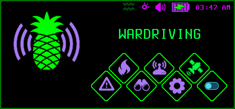

### Alerts
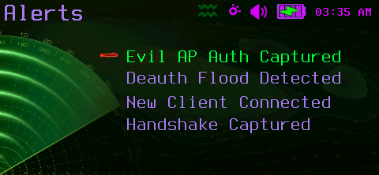

### Payloads
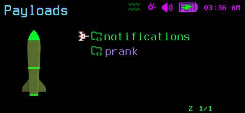

### Payload Category
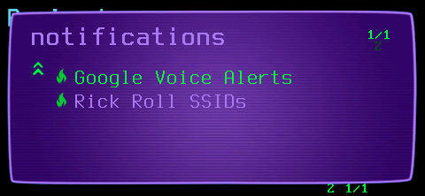

### Payload Launch

### Payload Executed
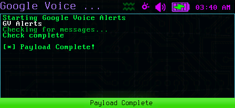

### Recon
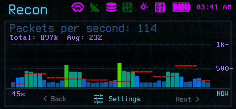

### PineAP
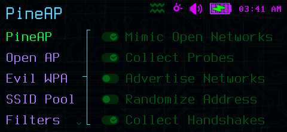

### PineAP Submenu
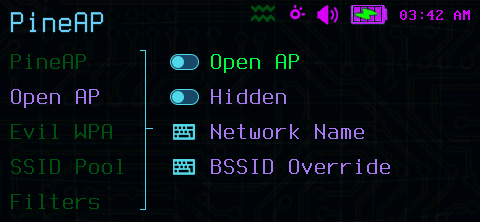

### Settings
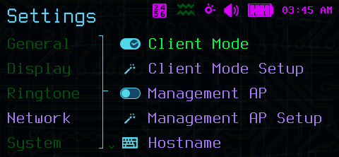

### Wardriving
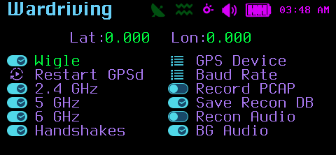

### GEIGER Toggle
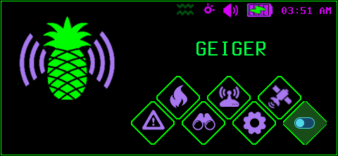

### Dialog Box
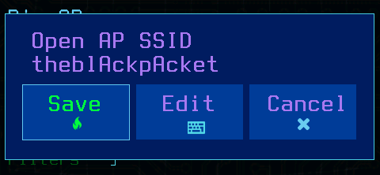

### On-Screen Keyboard
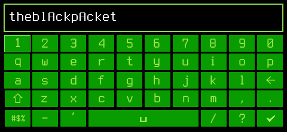

### Confirmation Dialog
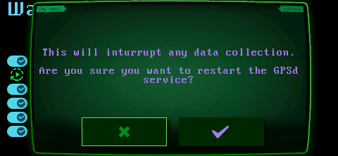

## Installation

1. Copy the theme folder to `/root/themes/` on your WiFi Pineapple Pager
2. Select the theme from Settings > Display > Theme

## Credits

- Boot screen artwork by **Pixel Jeff**
